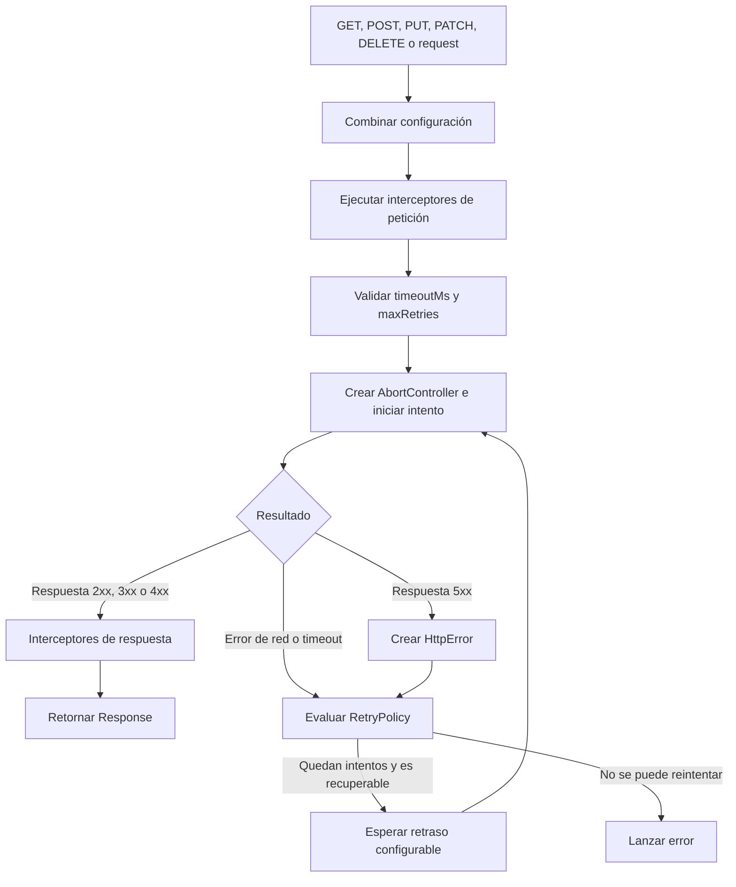

# SmartFetch: implementación técnica y guía de defensa

## 1. Información general

- **Proyecto:** SmartFetch
- **Versión documentada:** 1.0.0
- **Tecnología principal:** TypeScript
- **Entorno mínimo:** Node.js 18
- **Repositorio:** <https://github.com/aryacarpavila/SmartFetch>
- **Licencia:** ISC
- **Autores:** Arya Carpavila y Mauricio Caldera

SmartFetch es una librería que envuelve la API nativa `fetch`. Su objetivo es
ofrecer una interfaz de alto nivel para realizar peticiones HTTP con timeout,
reintentos, interceptores y errores controlados, sin añadir dependencias de
ejecución.

Este documento explica qué se implementó, cómo funciona internamente, qué
decisiones de diseño se tomaron, cómo se verificó el proyecto y cómo defenderlo.

## 2. Estado del proyecto

La versión 1.0.0 está integrada en `main` y `develop`, etiquetada como
`v1.0.0` y publicada como GitHub Release. El código, las pruebas y el paquete
están preparados para npm.

La publicación en el registro npm sigue siendo una operación independiente.
Una GitHub Release no publica automáticamente el paquete en npm.

### Validaciones de la versión 1.0.0

- 2 suites de Jest aprobadas.
- 33 pruebas aprobadas.
- 98.56 % de cobertura de sentencias.
- 93.33 % de cobertura de ramas.
- 97.36 % de cobertura de funciones.
- 98.51 % de cobertura de líneas.
- Compilación TypeScript en modo estricto.
- Ejemplo verificado por el compilador.
- Auditoría de dependencias de producción sin vulnerabilidades.
- Paquete comprobado con `npm pack --dry-run`.
- CI aprobada en Node.js 18, 20, 22 y 24.

## 3. Trazabilidad con el enunciado

| Requisito | Implementación | Evidencia principal |
| --- | --- | --- |
| Timeout configurable | `timeoutMs`, `AbortController` y `TimeoutError` | `SmartFetchClient.executeFetch` |
| Cancelación automática | La señal interna se aborta al vencer el temporizador | `src/client/smart-fetch-client.ts` |
| Reintentos ante 5xx | Las respuestas 500–599 se convierten en `HttpError` y se evalúan con la política | `request` y `DefaultRetryPolicy` |
| Reintentos ante errores de red | Los errores lanzados por `fetch`, salvo cancelaciones, son recuperables | `DefaultRetryPolicy.shouldRetry` |
| Un intento por defecto | `maxRetries` vale `0`; total de intentos: `maxRetries + 1` | `SmartFetchOptions` y pruebas |
| GET, POST, PUT, PATCH y DELETE | Métodos públicos de `SmartFetchClient` | `src/client/smart-fetch-client.ts` |
| Promesas y async/await | Todos los métodos retornan `Promise<Response>` | API pública y `example.ts` |
| TypeScript | Código fuente, tipos, ejemplo y pruebas escritos en TypeScript | `src`, `tests` y `example.ts` |
| Jest | Pruebas automatizadas de API y resiliencia | `tests` |
| GitFlow y GitHub | Features hacia `develop`, release hacia `main` y retorno a `develop` | Historial y PR del repositorio |
| JSDoc | Clases, interfaces, métodos y funciones documentados | Archivos de `src` |
| README | Instalación, integración, métodos y funciones avanzadas | `README.md` |
| Archivo de ejemplo | Ejemplo con timeout, reintentos e interceptores | `example.ts` |
| Patrones y AOP | Facade, Strategy, inyección de dependencias e interceptores | Arquitectura del cliente |
| Paquete NPM | Metadatos, declaraciones, contenido controlado y validaciones previas | `package.json` |

## 4. Arquitectura

### 4.1. Estructura de archivos

```text
SmartFetch/
├── .github/workflows/ci.yml
├── docs/
│   └── IMPLEMENTACION_Y_DEFENSA.md
├── src/
│   ├── client/
│   │   └── smart-fetch-client.ts
│   ├── errors/
│   │   ├── configuration-error.ts
│   │   ├── http-error.ts
│   │   └── timeout-error.ts
│   ├── interceptors/
│   │   └── interceptor.ts
│   ├── retry/
│   │   └── retry-policy.ts
│   ├── types/
│   │   └── smart-fetch-options.ts
│   ├── utils/
│   │   └── headers.ts
│   └── index.ts
├── tests/
│   ├── client-api.test.ts
│   └── core-resilience.test.ts
├── CHANGELOG.md
├── LICENSE
├── README.md
├── example.ts
├── package.json
├── tsconfig.example.json
└── tsconfig.json
```

### 4.2. Responsabilidad de cada módulo

| Módulo | Responsabilidad |
| --- | --- |
| `src/index.ts` | Define el punto de entrada público, exporta tipos y crea la instancia compartida `smartFetch` |
| `SmartFetchClient` | Coordina configuración, métodos HTTP, interceptores, timeout, cancelación y reintentos |
| `SmartFetchOptions` | Extiende `RequestInit` con `timeoutMs` y `maxRetries` |
| `RetryPolicy` | Contrato para decidir si se reintenta y cuánto se espera |
| `DefaultRetryPolicy` | Estrategia predeterminada para red, timeout y respuestas 5xx |
| `interceptor.ts` | Define los contratos de interceptores de petición y respuesta |
| `errors` | Contiene errores controlados y distinguibles mediante `instanceof` |
| `mergeHeaders` | Combina encabezados respetando precedencia y sin distinguir mayúsculas |

### 4.3. Flujo de una petición



## 5. API pública

### 5.1. Instancia compartida

`src/index.ts` exporta una instancia preparada para el uso más común:

```typescript
import { smartFetch } from '@aryacarpavila/smartfetch';

const response = await smartFetch.get('https://api.example.com/data');
```

Esta instancia es compartida por el módulo, pero no debe defenderse como un
Singleton estricto. La clase tiene constructor público y permite crear clientes
independientes, lo cual es necesario para usar configuraciones e interceptores
separados.

### 5.2. Clientes independientes

```typescript
import { SmartFetchClient } from '@aryacarpavila/smartfetch';

const client = new SmartFetchClient({
  timeoutMs: 3_000,
  maxRetries: 2,
  headers: {
    Authorization: 'Bearer token',
  },
});
```

También se puede derivar una configuración mediante `create`:

```typescript
const reportingClient = client.create({
  headers: {
    'X-Module': 'reporting',
  },
});
```

El cliente nuevo hereda la configuración y las dependencias reemplazables, pero
no comparte la colección de interceptores.

### 5.3. Métodos HTTP

```typescript
await smartFetch.get(url, options);
await smartFetch.post(url, payload, options);
await smartFetch.put(url, payload, options);
await smartFetch.patch(url, payload, options);
await smartFetch.delete(url, options);
await smartFetch.request(url, options);
```

`POST`, `PUT` y `PATCH`:

1. serializan el payload con `JSON.stringify`;
2. agregan `Content-Type: application/json`;
3. permiten que el consumidor reemplace ese encabezado;
4. retornan la promesa producida por el flujo común de `request`.

`request` permite utilizar cualquier configuración válida de `fetch`.

## 6. Implementación de la resiliencia

### 6.1. Timeout por intento

Cada intento crea su propio `AbortController`. Si se configuró `timeoutMs`, se
programa un temporizador que cancela la señal interna:

```typescript
const response = await smartFetch.get(url, {
  timeoutMs: 2_000,
});
```

Si la cancelación fue provocada por el temporizador, el error nativo se
transforma en:

```typescript
TimeoutError {
  name: 'TimeoutError',
  timeoutMs: 2000
}
```

El bloque `finally` siempre elimina el temporizador y retira el listener de la
señal externa. Esto evita listeners residuales y temporizadores activos después
de finalizar la petición.

### 6.2. Cancelación externa

El consumidor también puede controlar la cancelación:

```typescript
const controller = new AbortController();

const request = smartFetch.get(url, {
  signal: controller.signal,
  maxRetries: 3,
});

controller.abort();
await request;
```

La señal externa se conecta con el controlador interno. Una cancelación del
usuario no se reintenta, porque expresa una decisión del consumidor y no un
fallo temporal.

Si la señal ya estaba cancelada, `fetch` ni siquiera se ejecuta.

### 6.3. Reintentos

`maxRetries` representa reintentos adicionales:

| `maxRetries` | Total máximo de intentos |
| ---: | ---: |
| 0 | 1 |
| 1 | 2 |
| 2 | 3 |
| 3 | 4 |

La política predeterminada considera recuperables:

- respuestas HTTP entre 500 y 599;
- errores de red lanzados por `fetch`;
- `TimeoutError`.

No reintenta:

- cancelaciones externas (`AbortError`);
- respuestas 4xx;
- errores producidos después de recibir la respuesta, por ejemplo dentro de un
  interceptor de respuesta.

Los 4xx se retornan como `Response` porque normalmente representan un error de
la solicitud del cliente. Repetir la misma solicitud no suele corregir una URL
inexistente, una autenticación inválida o datos incorrectos.

### 6.4. Patrón Strategy

`RetryPolicy` separa la lógica de transporte de la decisión de reintento:

```typescript
interface RetryPolicy {
  shouldRetry(context: RetryContext): boolean;
  getDelayMs(context: RetryContext): number;
}
```

Esto implementa el patrón **Strategy**. El cliente trabaja contra la interfaz y
puede recibir otra estrategia sin modificar `SmartFetchClient`.

Ejemplo de estrategia personalizada:

```typescript
const retryPolicy: RetryPolicy = {
  shouldRetry: ({ response, error }) =>
    response?.status === 429 || error instanceof TypeError,
  getDelayMs: ({ attempt }) => 500 * (2 ** attempt),
};

const client = new SmartFetchClient({}, { retryPolicy });
```

`DefaultRetryPolicy` admite backoff exponencial. Su retraso base predeterminado
es cero para conservar reintentos inmediatos, pero puede configurarse:

```typescript
const client = new SmartFetchClient(
  { maxRetries: 3 },
  { retryPolicy: new DefaultRetryPolicy(250) },
);
```

Los retrasos serían 250 ms, 500 ms y 1000 ms.

### 6.5. Validación

Antes de iniciar `fetch`, el cliente comprueba que:

- `timeoutMs` sea un entero finito mayor que cero;
- `maxRetries` sea un entero finito mayor o igual que cero;
- el retraso generado por la estrategia sea finito y no negativo.

Los valores inválidos generan `ConfigurationError` y no producen tráfico de
red.

## 7. Interceptores y Programación Orientada a Aspectos

Los interceptores permiten encapsular preocupaciones transversales:

- autenticación;
- trazas y métricas;
- correlación de peticiones;
- normalización de configuración;
- observación o transformación de respuestas.

Estas funciones no forman parte de la lógica propia de un endpoint. Por eso
constituyen la implementación de Programación Orientada a Aspectos del
proyecto.

### 7.1. Interceptor de petición

```typescript
const id = smartFetch.addRequestInterceptor((config) => {
  const headers = new Headers(config.headers);
  headers.set('Authorization', 'Bearer token');
  return { ...config, headers };
});
```

Se ejecuta antes de validar y enviar la petición. Puede ser síncrono o
asíncrono y debe devolver la configuración que recibirá el siguiente
interceptor.

### 7.2. Interceptor de respuesta

```typescript
const id = smartFetch.addResponseInterceptor((response) => {
  console.log(response.status);
  return response;
});
```

Se ejecuta después de obtener una respuesta no 5xx. También puede ser síncrono
o asíncrono.

### 7.3. Orden y eliminación

Los interceptores se guardan en `Map`, por lo que se ejecutan en orden de
registro. Cada registro retorna un número que permite retirarlo:

```typescript
smartFetch.removeRequestInterceptor(requestId);
smartFetch.removeResponseInterceptor(responseId);
```

## 8. Manejo de errores

| Error | Hereda de | Cuándo se produce | Información adicional |
| --- | --- | --- | --- |
| `ConfigurationError` | `TypeError` | Configuración o retraso inválido | Mensaje descriptivo |
| `TimeoutError` | `Error` | Un intento supera `timeoutMs` | `timeoutMs` |
| `HttpError` | `Error` | Se agotan los intentos ante una respuesta 5xx | `status` y `response` |

Ejemplo:

```typescript
try {
  await smartFetch.get(url, { timeoutMs: 100, maxRetries: 1 });
} catch (error: unknown) {
  if (error instanceof TimeoutError) {
    console.error('Timeout:', error.timeoutMs);
  } else if (error instanceof HttpError) {
    console.error('Servidor:', error.status);
  } else if (error instanceof ConfigurationError) {
    console.error('Configuración:', error.message);
  }
}
```

Los errores de red originales se conservan cuando ya no corresponde
reintentarlos. Esto evita ocultar información útil del entorno.

## 9. Combinación de configuración y headers

La configuración específica de una petición tiene precedencia sobre la
configuración predeterminada.

Los headers no se combinan con un simple spread, porque `HeadersInit` puede ser:

- un objeto;
- una matriz de pares;
- una instancia de `Headers`.

`mergeHeaders` normaliza todos los formatos con la clase `Headers`. Esto también
resuelve correctamente diferencias como `Content-Type` y `content-type`.

Orden de precedencia:

1. headers predeterminados;
2. headers específicos de la petición;
3. en los métodos JSON, un `Content-Type` proporcionado por el consumidor
   reemplaza el valor automático.

## 10. Patrones y principios aplicados

### Facade

`SmartFetchClient` ofrece una API pequeña y comprensible sobre timeout,
cancelación, reintentos, headers e interceptores. El consumidor no necesita
coordinar directamente todos esos elementos de `fetch`.

### Strategy

`RetryPolicy` permite cambiar el algoritmo de reintento y espera sin modificar
el cliente.

### Interceptores / AOP

Las preocupaciones transversales se registran alrededor del flujo principal de
la petición sin acoplarlas a los métodos HTTP.

### Inyección de dependencias

El constructor acepta:

- una implementación alternativa de `fetch`;
- una política alternativa de reintentos.

Esto facilita las pruebas y reduce el acoplamiento con implementaciones
concretas.

### Instancia compartida

`smartFetch` facilita el uso directo de la librería. No se presenta como un
Singleton estricto, ya que el diseño permite instanciar clientes independientes.

### Separación de responsabilidades

Los errores, contratos, estrategia, utilidades y cliente están en módulos
distintos. Esta división facilita probar o sustituir cada responsabilidad.

## 11. TypeScript y construcción del paquete

### 11.1. Configuración

La compilación utiliza:

- `strict: true`;
- objetivo ECMAScript 2022;
- módulos CommonJS;
- tipos DOM para `fetch`, `Response`, `Headers` y `AbortController`;
- generación de declaraciones `.d.ts`;
- `src` como entrada y `dist` como salida.

El paquete requiere Node.js 18 o superior porque esa línea incorpora `fetch`
de forma nativa.

### 11.2. Punto de entrada

`src/index.ts` exporta:

- `SmartFetchClient`;
- `smartFetch`;
- errores controlados;
- política y contratos de reintento;
- contratos de interceptores;
- opciones y dependencias públicas.

`package.json` dirige JavaScript y declaraciones hacia:

```text
dist/index.js
dist/index.d.ts
```

### 11.3. Contenido publicable

La propiedad `files` limita el paquete a:

- `dist`;
- `LICENSE`;
- `CHANGELOG.md`.

npm también incorpora automáticamente archivos esenciales como
`package.json` y `README.md`.

No se publican las pruebas, el código TypeScript fuente ni configuraciones
internas innecesarias.

### 11.4. Dependencias

SmartFetch no tiene dependencias de ejecución. TypeScript, Jest, tipos de Jest y
`ts-jest` son herramientas de desarrollo y no se instalan como dependencias
transitivas del consumidor.

Esto reduce:

- superficie de vulnerabilidades;
- tamaño de instalación;
- conflictos de versiones;
- mantenimiento de dependencias.

## 12. Scripts disponibles

| Comando | Propósito |
| --- | --- |
| `npm run clean` | Elimina `dist` de manera portable |
| `npm run build` | Limpia y compila TypeScript |
| `npm test` | Ejecuta las pruebas en serie |
| `npm run test:coverage` | Ejecuta pruebas y exige al menos 90 % global |
| `npm run check:example` | Comprueba `example.ts` sin generar archivos |
| `npm run audit:production` | Audita únicamente lo que afecta al consumidor |
| `npm pack --dry-run` | Muestra y valida el contenido que se publicaría |
| `npm publish` | Publica después de superar los controles previos |

### Ciclo de publicación

`prepack` ejecuta la compilación antes de empaquetar.

`prepublishOnly` ejecuta:

1. cobertura;
2. comprobación del ejemplo;
3. auditoría de producción.

Si cualquiera falla, npm cancela la publicación.

## 13. Pruebas automatizadas

Como la librería no tiene dependencias de ejecución, el enunciado permite
concentrar la verificación en pruebas unitarias.

### 13.1. `client-api.test.ts`

Comprueba:

- existencia de la instancia compartida;
- método correcto para GET y DELETE;
- serialización JSON para POST, PUT y PATCH;
- combinación de headers predeterminados y específicos;
- precedencia de `Content-Type`;
- orden de interceptores de petición;
- orden de interceptores de respuesta;
- eliminación por identificador;
- independencia de clientes creados con `create`.

### 13.2. `core-resilience.test.ts`

Comprueba:

- un solo intento predeterminado;
- recuperación después de un 5xx;
- agotamiento exacto de reintentos;
- recuperación después de un error de red;
- ausencia de reintentos para 4xx;
- transformación del timeout;
- limpieza de temporizadores;
- cancelación externa;
- señal cancelada antes de iniciar;
- errores de interceptores sin reintento;
- validación de timeout y reintentos;
- estrategia personalizada;
- espera cancelable;
- rechazo de retrasos inválidos;
- estructura pública de `TimeoutError`.

Se utilizan mocks e inyección de `fetch` para que las pruebas sean rápidas,
deterministas y no dependan de servicios externos.

## 14. Integración continua

`.github/workflows/ci.yml` se ejecuta en:

- pushes a `main` y `develop`;
- pull requests dirigidos a `main` o `develop`;
- ejecución manual.

Primero se prueban en paralelo Node.js 18, 20, 22 y 24:

1. checkout;
2. instalación reproducible con `npm ci`;
3. build;
4. pruebas.

Cuando toda la matriz termina correctamente, el trabajo de paquete ejecuta:

1. cobertura;
2. verificación del ejemplo;
3. auditoría de producción;
4. `npm pack --dry-run`.

El flujo usa permisos de solo lectura y cancela ejecuciones anteriores de la
misma rama cuando una nueva las reemplaza.

## 15. GitFlow aplicado

### 15.1. Función de cada rama

- `main`: código liberado y evaluable.
- `develop`: integración de la siguiente versión.
- `feature/*`: cambios aislados que regresan a `develop`.
- `release/*`: estabilización de una versión que se integra en `main` y vuelve
  a `develop`.

### 15.2. Trabajo integrado

| Rama | Objetivo | Resultado |
| --- | --- | --- |
| `feature/core-resilience` | Corregir timeout, cancelación y reintentos | PR #1 hacia `develop` |
| `feature/client-api` | Mejorar API, métodos, headers e interceptores | PR #3 hacia `develop` |
| `feature/npm-publish` | README y metadatos iniciales de npm | PR #4 hacia `develop` |
| `feature/package-hardening` | Endurecer empaquetado y controles previos | PR #5 hacia `develop` |
| `feature/ci-quality` | Automatizar build, pruebas y paquete | PR #6 hacia `develop` |
| `release/1.0.0` | Preparar y liberar la versión | PR #7 a `main` y PR #8 a `develop` |

El PR #2 se cerró sin integrarse porque apuntaba a `main` desde una feature. El
PR correcto era el #1, dirigido a `develop`.

### 15.3. Commits

Se utilizaron mensajes breves con prefijos convencionales:

- `feat:` para funcionalidades;
- `fix:` para correcciones;
- `docs:` para documentación;
- `test:` para pruebas;
- `ci:` para automatización;
- `chore:` para configuración y mantenimiento.

Los commits registran a las personas configuradas en Git. No se añadió ninguna
línea `Co-authored-by` de herramientas de IA.

## 16. Cómo se creó la GitHub Release

Una release de GitHub está asociada a una etiqueta Git que identifica un commit
exacto.

El proceso aplicado fue:

1. partir de un `develop` estable;
2. crear `release/1.0.0`;
3. añadir `CHANGELOG.md` y finalizar los metadatos;
4. abrir el PR #7 desde `release/1.0.0` hacia `main`;
5. esperar que todas las comprobaciones de CI fueran exitosas;
6. integrar el PR;
7. crear la etiqueta anotada `v1.0.0` sobre el merge de `main`;
8. subir la etiqueta a GitHub;
9. crear la GitHub Release a partir de esa etiqueta;
10. integrar la release de vuelta a `develop` mediante el PR #8;
11. eliminar la rama temporal `release/1.0.0`.

Comandos equivalentes:

```bash
git switch main
git pull --ff-only origin main
git tag -a v1.0.0 -m "SmartFetch 1.0.0"
git push origin v1.0.0

gh release create v1.0.0 \
  --repo aryacarpavila/SmartFetch \
  --verify-tag \
  --title "SmartFetch 1.0.0"
```

La sección **Releases** que aparece en GitHub proviene de este último paso. La
release permite consultar notas y descargar el código fuente correspondiente a
la etiqueta.

### 16.1. Por qué GitHub muestra “1 ahead” y “1 behind”

`release/1.0.0` se integró una vez en `main` y otra vez en `develop`. Cada PR
generó su propio commit de merge:

- un merge pertenece a `main`;
- el otro pertenece a `develop`.

Por eso GitHub encuentra un commit exclusivo en cada historial. No significa
que falten archivos: el contenido de ambas ramas fue comparado y es idéntico.
Es una consecuencia normal del cierre de release mediante merges no lineales.

## 17. GitHub Release y paquete npm no son lo mismo

| GitHub Release | Publicación npm |
| --- | --- |
| Identifica una versión del repositorio | Distribuye un paquete instalable |
| Usa una etiqueta Git | Usa nombre y versión de `package.json` |
| Permite descargar el código fuente | Permite `npm install` |
| Está creada para `v1.0.0` | Sigue pendiente |

Hasta ejecutar correctamente `npm publish`, GitHub mostrará una release pero la
sección **Packages** permanecerá vacía y este comando no funcionará:

```bash
npm install @aryacarpavila/smartfetch
```

## 18. Alternativas para publicar en npm

El scope npm y el propietario del repositorio GitHub son sistemas separados.
Ser colaborador del repositorio no concede permiso para publicar bajo
`@aryacarpavila`.

### Opción A: publicar con la cuenta propietaria

Si `@aryacarpavila` es el scope personal npm de Arya, ella realiza la primera
publicación:

```bash
git switch main
git pull --ff-only origin main
npm login
npm whoami
npm publish --access public
```

Esta opción mantiene sin cambios el nombre documentado y la release.

Para una publicación directa, npm exige 2FA en la cuenta o un token granular
con autorización adecuada.

### Opción B: convertir o utilizar un scope de organización

Si `aryacarpavila` es una organización npm, su propietaria puede invitar la
cuenta npm de Mauricio y conceder acceso de lectura y escritura. Después de
aceptar la invitación, Mauricio puede autenticarse y publicar.

Los permisos se administran en npm, no en GitHub.

### Opción C: añadir a Mauricio como mantenedor

Después de que el paquete exista, su propietaria puede invitar otro mantenedor:

```bash
npm owner add <usuario-npm-de-mauricio> @aryacarpavila/smartfetch
```

El nuevo mantenedor debe aceptar la invitación. A partir de entonces puede
publicar versiones posteriores.

Esta opción no resuelve por sí sola la primera publicación si el paquete todavía
no existe bajo un scope personal ajeno.

### Opción D: cambiar el paquete a un scope controlado por Mauricio

Si Arya no puede acceder a npm, Mauricio puede crear su propia cuenta y cambiar:

```json
{
  "name": "@usuario-npm-de-mauricio/smartfetch"
}
```

También deben actualizarse:

- `package-lock.json`;
- instrucciones de instalación e imports del README;
- ejemplos y documentación;
- metadatos o release para mantener coherencia.

Después:

```bash
npm login
npm whoami
npm publish --access public
```

Este cambio debe hacerse en una nueva rama feature y pasar nuevamente por CI.
No debe realizarse hasta conocer el nombre exacto de la cuenta npm.

### Recomendación

1. Si Arya puede entrar a npm: usar la opción A.
2. Si ambos quieren mantener el paquete: utilizar una organización y conceder
   acceso de escritura.
3. Si Arya no puede usar npm: cambiar el scope a la cuenta de Mauricio antes de
   la primera publicación.
4. Después de la primera publicación, configurar publicación confiable desde
   GitHub Actions mediante OIDC para evitar compartir tokens permanentes.

La publicación confiable no reemplaza la creación inicial del paquete: npm
requiere que el paquete ya exista para configurar esa relación.

Documentación oficial:

- <https://docs.npmjs.com/creating-and-publishing-scoped-public-packages/>
- <https://docs.npmjs.com/package-scope-access-level-and-visibility/>
- <https://docs.npmjs.com/adding-members-to-your-organization/>
- <https://docs.npmjs.com/trusted-publishers/>

## 19. Guion recomendado para la defensa

### 19.1. Demostración

1. Presentar el problema: `fetch` no incorpora directamente timeout,
   interceptores ni política de reintentos.
2. Mostrar la estructura modular de `src`.
3. Ejecutar:

   ```bash
   npm ci
   npm run build
   npm test
   npm run test:coverage
   npm pack --dry-run
   ```

4. Explicar `SmartFetchOptions`.
5. Recorrer `SmartFetchClient.request`.
6. Mostrar cómo `executeFetch` combina timeout y cancelación externa.
7. Mostrar `RetryPolicy` como Strategy.
8. Registrar un interceptor de autenticación.
9. Ejecutar o explicar `example.ts`.
10. Mostrar el workflow de GitHub Actions y la release `v1.0.0`.

### 19.2. Explicación corta del flujo

> La llamada entra por un método HTTP, se combina con la configuración
> predeterminada y pasa por los interceptores de petición. Luego se valida,
> se ejecuta `fetch` con una señal controlada y se clasifica el resultado. Los
> fallos recuperables pasan por la estrategia de reintentos; las respuestas
> válidas pasan por los interceptores de respuesta y se retornan como una
> promesa.

### 19.3. Preguntas probables

**¿Por qué no se utilizó Axios?**

Porque el objetivo es construir una capa de alto nivel sobre `fetch` sin
dependencias de ejecución. Esto reduce tamaño, acoplamiento y superficie de
vulnerabilidades.

**¿Por qué TypeScript?**

Permite extender `RequestInit`, documentar los contratos, validar el uso desde
el editor y distribuir declaraciones `.d.ts`.

**¿Cuántos intentos hace `maxRetries: 3`?**

Cuatro: el intento original y tres reintentos adicionales.

**¿Por qué los 4xx no se reintentan?**

Porque normalmente expresan un problema persistente de la solicitud. Los 5xx y
errores de red tienen mayor probabilidad de ser transitorios.

**¿El timeout aplica a toda la operación?**

Aplica individualmente a cada intento. Cada reintento crea un nuevo controlador
y temporizador.

**¿Qué patrón se usa para los reintentos?**

Strategy. `SmartFetchClient` depende de `RetryPolicy`, no de un algoritmo fijo.

**¿Dónde está la Programación Orientada a Aspectos?**

En los interceptores, que encapsulan autenticación, logging u otras
preocupaciones transversales alrededor de la petición.

**¿`smartFetch` es un Singleton?**

Es una instancia compartida exportada por el módulo, pero la clase no impone un
Singleton estricto. Se permiten clientes independientes.

**¿Cómo se evitan fugas de recursos?**

El temporizador se limpia en `finally` y los listeners de cancelación se retiran
al terminar la petición o la espera.

**¿Cómo se prueba sin depender de Internet?**

Se reemplaza `fetch` con mocks y se inyectan políticas controladas. Los timers
falsos de Jest permiten probar timeout y backoff sin esperar tiempo real.

**¿Por qué una GitHub Release no aparece como paquete?**

Porque GitHub Releases y npm son registros distintos. La etiqueta marca el
código liberado, mientras `npm publish` distribuye el paquete instalable.

## 20. Lista de verificación final

- [x] Código TypeScript en `main`.
- [x] API GET, POST, PUT, PATCH y DELETE.
- [x] Promesas y async/await.
- [x] Timeout y error controlado.
- [x] Reintentos configurables y un intento por defecto.
- [x] Interceptores y patrón Strategy.
- [x] JSDoc.
- [x] README y `example.ts`.
- [x] Pruebas automatizadas.
- [x] Cobertura mínima automatizada.
- [x] CI multiversión.
- [x] Flujo GitFlow.
- [x] Tag y GitHub Release `v1.0.0`.
- [ ] Publicación efectiva en npm.

